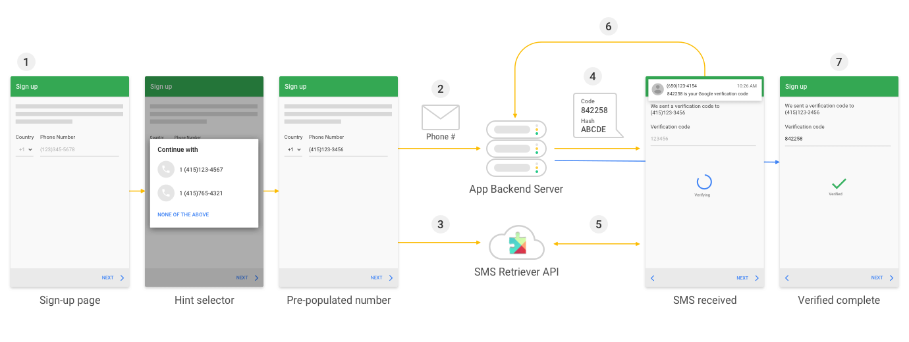

# Retriever-API-SMS-Automatic
SMS Retriever API, you can perform SMS-based user verification in your Android app automatically, without requiring the user to manually type verification codes, and without requiring any extra app permissions. When you implement automatic SMS verification in your app
the verification flow looks like this:

## Prerequisites
The SMS Retriever API is available only on Android devices with Play services version 10.2 and newer.

## Important
The standard SMS format is given blow.

    <#> Your ExampleApp code is: 123ABC78 
    fGXfpK7Ticp

SMS alwayse starts with <#> sign and have a hash key fGXfpK7Ticp to identify your app it is generated with your app's package id. You just need to get this has key from app and share with your server. 
In next few steps you will see how to create hash keys.
hashKey in debugMode is different releaseMode 
when get hashkey for release share with your server 

## Documentation 
[(`see more details Google Documentation`]( https://developers.google.com/identity/sms-retriever/overview))

## libraries in dependency
The standard SMS format is given blow.

    implementation 'com.google.android.gms:play-services-auth:17.0.0'
    implementation 'com.google.android.gms:play-services-auth-api-phone:17.3.0'

## Optional Code 
to get user's phone number

     val mGoogleApiClient:GoogleApiClient = GoogleApiClient.Builder(this)
    .addConnectionCallbacks(this)
    .addOnConnectionFailedListener(this)
    .enableAutoManage(this, 0 /* clientId */, this)
    .build()
    
      private fun requestHint() {
        val hintRequest = HintRequest.Builder()
            .setPhoneNumberIdentifierSupported(true)
            .build()

        val intent = Auth.CredentialsApi.getHintPickerIntent(mGoogleApiClient,hintRequest)
       // Auth.CredentialsApi.
        startIntentSenderForResult(
            intent.intentSender,
            RESOLVE_HINT, null, 0, 0, 0
        )
    }
    
    // Obtain the phone number from the result
    public override fun onActivityResult(requestCode: Int, resultCode: Int, data: Intent?) {
        super.onActivityResult(requestCode, resultCode, data)
        if (requestCode == RESOLVE_HINT) {
            if (resultCode == Activity.RESULT_OK) {
                val credential = data!!.getParcelableExtra(Credential.EXTRA_KEY) as Credential
                // credential.getId();  <-- will need to process phone number string
            }
        }
    }
    
    
